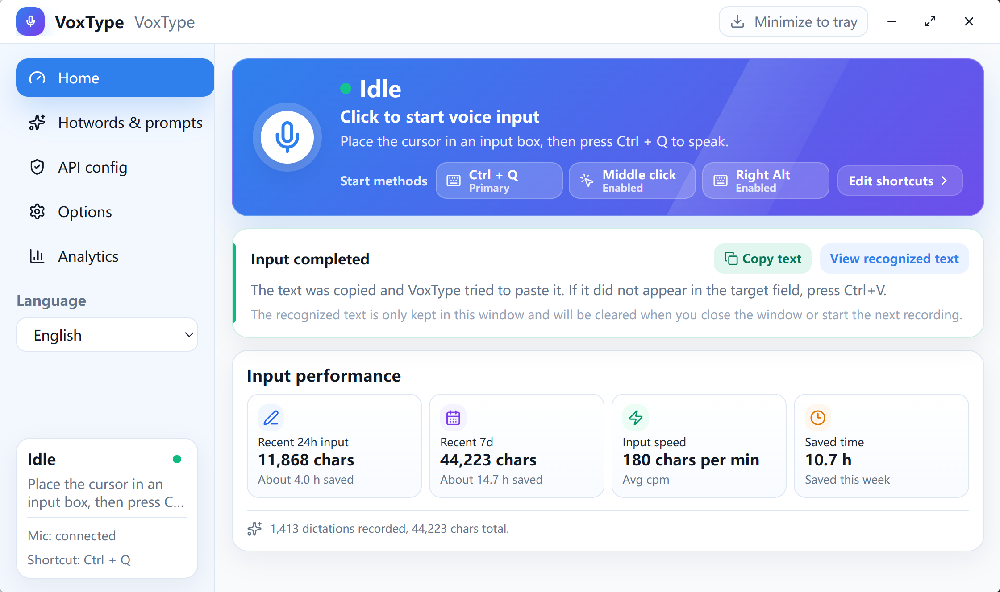
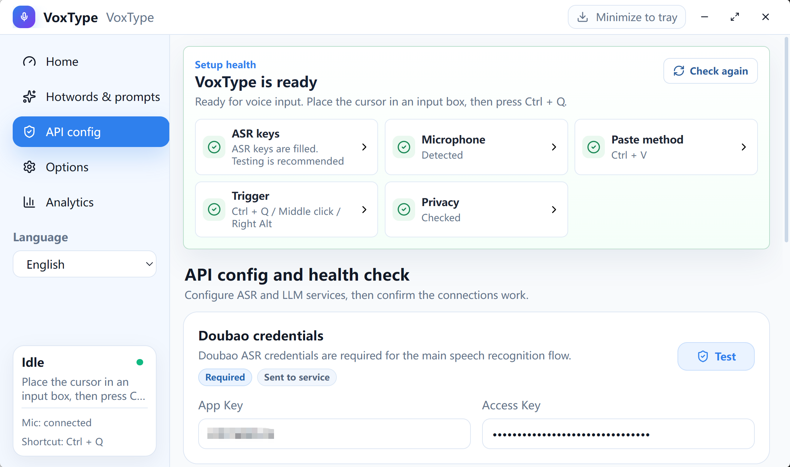

# VoxType - Rust/Tauri Windows AI Voice Typing App

[简体中文](README.md) | English

VoxType is a lightweight Rust/Tauri Windows 10/11 desktop AI voice typing, dictation, and speech-to-text app. Put the cursor in any input box, press the global shortcut, speak, and VoxType will record microphone audio, transcribe it with Doubao streaming ASR, optionally polish the result with an OpenAI-compatible LLM, copy it to the clipboard, paste it into the active input field, and restore the previous clipboard when possible.

The current project is a root-level Tauri app. Rust handles global shortcuts, input hooks, audio capture, ASR sessions, clipboard output, tray behavior, floating captions, updates, and system audio. Svelte handles the main window UI.

This is a personal project. The priority is practicality, simplicity, and maintainability. Do not commit real API keys, personal hotwords, local context files, logs, or stats files.

## Use Cases

- Voice typing in any Windows text field, including Chinese dictation, English dictation, and multilingual speech-to-text.
- Real-time captions and final transcripts powered by Doubao streaming ASR, then automatic paste into chat apps, browsers, editors, forms, or office tools.
- Optional LLM polishing for long spoken text, reducing filler words, recognition noise, and formatting issues.
- A local, open-source Windows dictation workflow that keeps usage stats free of transcript text by default.

## Documentation

- Repository docs index: [docs/README.md](docs/README.md)
- Wiki home: <https://github.com/zkwi/VoxType/wiki>
- User configuration guide: <https://github.com/zkwi/VoxType/wiki/Setup-Guide-English>
- Features and usage optimization: <https://github.com/zkwi/VoxType/wiki/Feature-Guide-English>
- Troubleshooting: <https://github.com/zkwi/VoxType/wiki/Troubleshooting-English>
- Contributing guide: [CONTRIBUTING.md](CONTRIBUTING.md)
- Security policy: [SECURITY.md](SECURITY.md)
- Support policy: [SUPPORT.md](SUPPORT.md)
- Code of conduct: [CODE_OF_CONDUCT.md](CODE_OF_CONDUCT.md)
- License: [MIT](LICENSE)

## Interface Preview

The Home page centers the current input state, the primary shortcut, middle mouse, and right Alt in one compact voice card. After a successful input, VoxType shows that the text was copied and paste was attempted; the latest recognized text can be copied or viewed temporarily, then is cleared when the window closes or the next recording starts. Input performance cards show recent 24-hour input, recent 7-day input, average speed, and saved time. Saved time is estimated as manual typing time minus actual voice duration.



The sidebar is organized by task: Home, Prompts, API Config, Options, Privacy, and Analytics. The privacy page explains where the config file, logs, recent context, suggested-term history, usage stats, ASR audio, screen OCR, LLM polishing text, and clipboard snapshots are stored or sent, and it provides clearing actions for local context, suggested-term history, and stats.

API Config starts with a setup health check instead of a generic status header. ASR keys, microphone, paste method, trigger method, and privacy status are shown separately, and Doubao ASR plus optional LLM sections include test actions. The screenshot below has credentials blurred; public screenshots and logs should do the same.



## Windows Voice Typing Features

- Global trigger: `Ctrl + Q` is enabled by default. Right Alt and middle mouse can be enabled manually.
- Microphone capture: PCM audio capture through Rust `cpal`; input device can be selected.
- Real-time speech recognition: Doubao `bigmodel_async` WebSocket with live caption fragments and final speech-to-text output.
- Local silence fallback: local low-volume auto-stop defaults to 30 seconds with a `0.03` threshold, less aggressive than the old 10-second / `0.04` default, so long dictation and quiet speech are less likely to be cut off. You can adjust it in Options.
- Floating captions: real-time transcription feedback near the bottom of the screen. Captions show text, processing state, and errors only.
- Automatic output: final text is copied to the clipboard and pasted with `Ctrl+V` or `Shift+Insert`; clipboard-only mode is also available. VoxType then tries to restore the previous clipboard.
- Recent input card: after a successful input, the Home page can temporarily show and copy the latest recognized text. It is kept only in the current window memory and is cleared when the window closes or a new recording starts.
- Home layout: the top voice card shows the current state plus the primary hotkey, middle mouse, and right Alt in compact single-line chips. Recent input and input stats stay below it.
- Optional LLM polishing: OpenAI-compatible API support for light text cleanup, style control, and an explicit "use recent context for polishing" switch.
- Screen OCR context: on by default. When recording starts, VoxType captures the current display by default, with an option to switch to the current window only. It runs Windows OCR locally, lightly merges extra spaces between adjacent CJK characters, and sends the temporary text context to Doubao ASR and the optional LLM to improve names, filenames, code identifiers, and UI terms. Timeout or OCR failure is skipped automatically.
- Prompts and terms: maintain recognition terms, scene notes, and AI prompts.
- Automatic hotword candidates: optional local history and manual LLM candidate generation; candidates must be confirmed before joining hotwords. The default history limit is 5000 characters; the old 10000-character default is migrated to 5000 on config load. Candidate generation uses a larger output and timeout budget than normal polishing; if the full history response is incomplete or times out, VoxType retries once with a smaller recent-history window and fewer candidates. If it still fails, reduce the history text limit or candidate count in `config.toml` and retry.
- Tray resident mode: closing the main window hides it to the tray by default. During input and processing, the tray icon switches to an active state. Single-click the tray icon to open the main window; the tray menu can open config, open logs, report an issue, check updates, restart the app, or exit.
- Updates: the Options page and tray menu can check GitHub Releases. When a new version is found, the UI shows an "Update now" action.
- Diagnostics: logs and redacted diagnostic reports help troubleshoot ASR, paste, network, and update issues.
- Privacy & local data: available from the sidebar. It shows storage and upload boundaries for config and keys, logs and diagnostic reports, recent context, automatic hotword history, usage stats, ASR audio, screen OCR, LLM polishing text, and clipboard snapshots; it can clear recent context, automatic hotword history, and usage stats.
- Settings layout: visible settings are shown directly by task page. Options is grouped into common settings, enhancements, and maintenance so daily controls come before maintenance entries. Low-level protocol, resource ID, timeout, clipboard snapshot, retry, caption size/position, and similar implementation parameters stay in `config.toml`.
- Languages: Simplified Chinese, Traditional Chinese, and English.

## Main Workflow Guarantees

These rules protect user trust in the core voice input flow:

- Empty recognition becomes a failure. It does not show "pasted", does not run LLM polishing, does not paste, and does not record successful stats.
- The UI only shows "polishing text" when LLM polishing is enabled, text length reaches `min_chars`, and Base URL, API Key, and model are complete.
- Floating captions do not show paste-state noise such as "pasting" or "pasted".
- Usage stats never store recognized text. They store duration, character count, speed, and time estimates only.
- Logs and diagnostic reports should not include real API keys, recognized text, hotwords, prompts, recent context text, automatic hotword history text, or Windows username paths.

## Requirements

VoxType targets Windows 10/11.

Normal users should download the Windows installer from GitHub Releases:

<https://github.com/zkwi/VoxType/releases>

The installer includes the Microsoft Edge WebView2 Bootstrapper. If WebView2 Runtime is missing, the installer installs it automatically.

If the main window stays blank or gets stuck on the startup page, the Microsoft Edge WebView2 Runtime on the system is usually broken, missing, or blocked by policy. Follow "Blank startup window or stuck startup page" in [Troubleshooting](https://github.com/zkwi/VoxType/wiki/Troubleshooting-English) first. VoxType should not silently repair system components from inside the app.

VoxType also needs Windows microphone permission:

```text
Windows Settings -> Privacy & security -> Microphone -> Let desktop apps access your microphone
```

Development requires:

- Node.js and npm
- Rust toolchain

If Rust is installed but `cargo` is not found in the current terminal:

```powershell
$env:PATH="$env:USERPROFILE\.cargo\bin;$env:PATH"
```

## Configuration

The minimum required configuration is Doubao ASR authentication. Without it, recording, recognition, and paste stay locked so VoxType does not pretend an input succeeded.

Quick configuration map:

| Scenario | Required | Optional for later | Test entry |
| --- | --- | --- | --- |
| Speech-to-text only | Doubao ASR App Key and Access Key | LLM API, hotwords, screen OCR | Doubao ASR test in API Config |
| Polished output | Doubao ASR plus LLM Base URL, API Key, model, and polishing enabled | Automatic hotword candidates | LLM test in API Config |
| Test fails | Read the red message, check keys, check network/proxy | Avoid changing advanced parameters first | Copy a redacted diagnostic report |

```toml
[auth]
app_key = ""
access_key = ""
resource_id = "volc.seedasr.sauc.duration"
```

VoxType currently follows the Doubao streaming ASR WebSocket header shape with `X-Api-App-Key`, `X-Api-Access-Key`, and `X-Api-Resource-Id`. The default `resource_id` is `volc.seedasr.sauc.duration`, the hourly billing resource for the speech recognition big model 2.0. Change it only if your Volcano Engine account uses a concurrent resource or an older model resource. Do not paste an LLM API key, GitHub token, or unrelated cloud secret into the ASR fields. The Doubao credentials panel includes a docs link so first-time setup can be checked against the official field descriptions.

API Config also includes the Doubao ASR input language. The default is `zh-CN` for Chinese speech. For multilingual use, switch to a supported language code such as `en-US`, `ja-JP`, or `yue-CN`, or choose Auto/service default to omit the parameter. Doubao documents this option as supported only by some streaming modes, so if the ASR test fails, switch back to Auto/service default or confirm the current API mode.

Common Doubao ASR test failures:

| Message | Check first |
| --- | --- |
| Authentication or permission failure | App Key, Access Key, and Resource ID belong to the same Doubao speech service and account |
| Connection failure or timeout | Network, proxy, firewall access to `openspeech.bytedance.com` |
| Language-related failure | Switch Recognition language back to Auto/service default and test again |
| Test passes but recording is empty | Windows microphone permission, input device, mic volume, and background noise |

Settings edited in the UI auto-save. The title bar briefly shows pending, saving, and saved states so you can tell when a change has taken effect.

Optional LLM polishing:

```toml
[llm_post_edit]
enabled = false
use_recent_context = false
base_url = "https://dashscope.aliyuncs.com/compatible-mode/v1"
api_key = ""
model = "qwen3.5-plus"
min_chars = 40
enable_thinking = false
thinking_strategy = "auto"
```

LLM polishing uses an OpenAI-compatible API. The default example uses Alibaba Cloud Bailian/DashScope Beijing at `https://dashscope.aliyuncs.com/compatible-mode/v1`. The Base URL may be a service root, a `/v1` URL, or a full `/chat/completions` URL; for example, `https://api.deepseek.com`, `https://api.deepseek.com/v1/`, and `https://api.deepseek.com/v1/chat/completions` are treated as equivalent. The `api_key` must come from the same provider and region as the Base URL, and `model` must be available to that account. If you only need speech recognition, leave LLM polishing disabled. When enabled, text shorter than `min_chars` skips polishing by default to reduce latency. Final transcripts that reach the minimum length are sent to your configured AI service; recognition terms, writing/product preferences, screen OCR, and optional recent context are appended as reference information. Recent context for AI is off by default; it is sent only when both `[context].enable_recent_context` and `[llm_post_edit].use_recent_context` are enabled, and it is capped to about 600 chars from the latest snippets. `thinking_strategy = "auto"` chooses a provider-compatible way to disable thinking/reasoning, such as `enable_thinking=false` for DashScope, `thinking.type=disabled` for DeepSeek and MiMo, and low reasoning effort for OpenRouter. The LLM test tries candidate strategies and saves the fastest successful result; it does not read local recent-context text.

For DashScope model-selection notes, see [2026-05-28 LLM polishing model test](docs/audits/2026-05-28-llm-polishing-model-test.md). The practical choices from that test were `qwen3.7-max` for daily use, `qwen3.6-flash-2026-04-16` for lower latency, and `deepseek-v4-pro` for technical text.

Common LLM test failures:

| Message | Check first |
| --- | --- |
| API Key or permission failure | Key belongs to the configured Base URL provider and region |
| Model not found | Model name spelling and account access |
| Connection failure | Base URL belongs to the configured provider, network/proxy is usable |
| Test passes but polishing does not run | Polishing is enabled and text length reaches `min_chars` |

VoxType includes a simplified default AI prompt for voice input. It treats recognized text as source material, not instructions to follow, so questions or prompt-like content are polished instead of answered or analyzed. It corrects obvious ASR errors, missing words, punctuation, segmentation, repetition, and filler words without adding facts, inference, or calculations, while preserving proper nouns, English abbreviations, finance terms, and programming terms. User dictionary terms, writing/product preferences, optional recent context, and screen OCR are appended to real requests as separate reference-information blocks; they are only used to correct terms, names, UI words, continuity, and wording preferences, not as text to polish or instructions to follow, and they must not add information that the text to polish did not say. In finance, investing, and quant contexts, the default prompt asks the LLM to normalize clear amounts, returns, and percentages into common numeric forms, such as `100万` and `1%`, without calculating returns or answering the question. The Hotwords page now puts recognition terms and writing context before the AI prompt template, reset, preview, and minimum polishing length. The preview shows reference-information rules, whether writing context enters the AI prompt, whether recent context enters the AI prompt, and the current screen OCR policy. Minimum polishing length is adjustable on the Hotwords page and supports 0 to 10000. System Prompt remains in `config.toml` to keep the app settings concise.

Screen OCR context is on by default and can be disabled, tested, or limited to the current window in Options. The default range is the current display, which helps when you reference one document while typing into another window. OCR text is kept only for the current request and is not written to logs, stats, or config files; VoxType does not cache the latest 2-3 screenshot OCR results. Before sending the context, VoxType lightly merges extra spaces between adjacent CJK characters, so text such as `屏 幕 OCR 上 下 文` becomes easier for ASR/LLM context matching while English acronyms, shortcuts, and paths keep their spacing. The default wait is 700 ms; timeout or failure does not block recording, ASR, or paste.

```toml
[screen_context]
enabled = true
capture_scope = "screen"  # screen = current display, window = current window only
max_chars = 1200
timeout_ms = 700
```

Recommended trigger defaults:

```toml
[triggers]
hotkey_enabled = true
middle_mouse_enabled = false
right_alt_enabled = false
```

Recommended output defaults:

```toml
[typing]
paste_method = "ctrl_v"
remove_trailing_period = true
restore_clipboard_after_paste = true
clipboard_restore_delay_ms = 800
```

Recording defaults:

```toml
[audio]
max_record_seconds = 300
silence_auto_stop_seconds = 30
silence_level_threshold = 0.03
mute_system_volume_while_recording = false
```

`config.toml`, local logs, local context files, and stats files are ignored by Git. Example config and docs should contain placeholders only.

## First Use

1. Install and start VoxType.
2. Open API Config.
3. Fill in Doubao ASR App Key and Access Key. Resource ID uses the default value and can be changed in `config.toml` only when needed.
4. Click the ASR test button.
5. Return to Home.
6. Put the cursor in a target input field.
7. Press `Ctrl + Q` to start recording.
8. Press `Ctrl + Q` again to stop recording, or wait for the local low-volume fallback.
9. Wait for final recognition and optional polishing.
10. If text does not appear in the target field, press `Ctrl + V` manually.

## FAQ

### What is VoxType?

VoxType is a Windows desktop voice typing app. It turns microphone speech into text with Doubao streaming ASR, then copies and pastes the result into the active input field. It is a dictation assistant, not a chatbot.

### Where can I use VoxType?

VoxType works best in apps that accept clipboard paste, including browser fields, chat apps, Markdown editors, IDEs, office documents, and internal admin tools. For apps that block `Ctrl + V`, try `Shift + Insert` or clipboard-only mode.

### Does VoxType store my transcript text?

Not by default. Usage stats store duration, character count, speed, and time estimates, not transcript text. Recent context and automatic hotword history stay off by default. When recent context is enabled it is sent to Doubao ASR; it is sent to the AI service only when "use recent context for polishing" is also enabled and polishing actually runs. Screen OCR context is on by default but is not persisted or cached across recordings; it is only sent temporarily with the current ASR/LLM request and can be disabled in Options or Privacy & local data. Local context, hotword history, and usage stats can be cleared from Privacy & local data. Clear actions only remove VoxType local files; retention by third-party ASR/LLM providers depends on the provider you configure.

### Why does VoxType need Doubao ASR keys?

The core workflow depends on Doubao streaming speech recognition. Without App Key and Access Key, recording, recognition, and automatic paste stay locked so the app does not pretend an input succeeded.

## Development

Install dependencies and start the Tauri development app:

```powershell
npm install
npm run tauri dev
```

The development server uses:

```text
http://127.0.0.1:18080
```

## Build

Debug build:

```powershell
npx tauri build --debug --no-bundle
```

Release build:

```powershell
npx tauri build
```

The release executable is usually at:

```text
src-tauri\target\release\voxtype-desktop.exe
```

Do not use `cargo build --release` as the desktop release artifact. It does not build frontend resources first.

## Checks

Common local checks:

```powershell
npm run check
npm run build
npm run scan:secrets
npm run test:secrets
npm run audit:npm
npm run audit:rust
Set-Location .\src-tauri
cargo fmt --check
cargo check
cargo test
cargo clippy --all-targets -- -D warnings
```

AI-maintenance local check:

```powershell
npm run ai:check
```

Release check:

```powershell
npm run ai:release-check
```

Rust dependency audit requires `cargo-audit`. Install it first when missing:

```powershell
cargo install cargo-audit --locked
```

## Contributing

Before opening an Issue or Pull Request, read [CONTRIBUTING.md](CONTRIBUTING.md), [SUPPORT.md](SUPPORT.md), and [CODE_OF_CONDUCT.md](CODE_OF_CONDUCT.md). Small, focused bug fixes, documentation updates, config examples, and tests are welcome. Changes touching ASR, LLM polishing, clipboard/paste, hotkeys, tray behavior, logs, stats, or config structure should clearly describe their impact and verification steps.

For security or privacy issues, follow [SECURITY.md](SECURITY.md). Do not include real keys, transcripts, personal hotwords, prompts, recent context, raw logs, or Windows username paths in public Issues, Pull Requests, screenshots, or logs.

## Project Layout

```text
VoxType/
├── src/                         # Svelte main window UI
├── src-tauri/                   # Tauri/Rust desktop backend
│   ├── src/
│   │   ├── audio.rs             # Microphone capture
│   │   ├── asr.rs               # ASR request and result parsing
│   │   ├── asr_ws.rs            # Doubao WebSocket session
│   │   ├── autostart.rs         # Windows startup integration
│   │   ├── config.rs            # TOML config model and IO
│   │   ├── hotkey.rs            # Global hotkey and input hooks
│   │   ├── llm_post_edit.rs     # LLM post-editing
│   │   ├── overlay.rs           # Floating captions
│   │   ├── session.rs           # Recording session state machine
│   │   ├── stats.rs             # Usage stats without transcript text
│   │   ├── system_audio.rs      # System volume control
│   │   ├── text_output.rs       # Clipboard and paste
│   │   ├── tray.rs              # System tray
│   │   └── update.rs            # GitHub Release update checks
│   └── tauri.conf.json
├── docs/                        # Engineering and reference docs
├── scripts/                     # Checks, hooks, and secret scanning
├── config.example.toml          # Placeholder config template
├── README.md                    # Simplified Chinese README
└── README.en.md                 # English README
```

## Local Files Not To Commit

- `config.toml`
- `*.local.toml`
- `context/recent_context.jsonl`
- `context/hotword_history.jsonl`
- `voice_input.log`
- `voice_input_stats.jsonl`
- `src-tauri/target/`
- `node_modules/`
- `build/`
