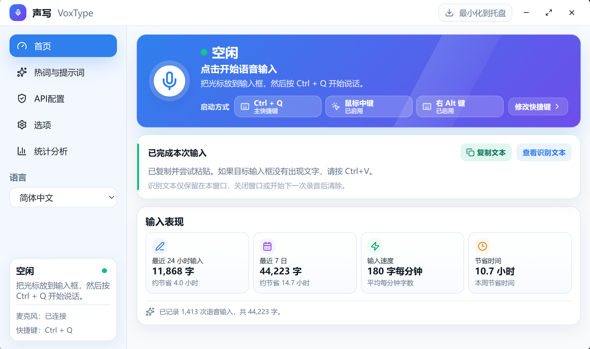
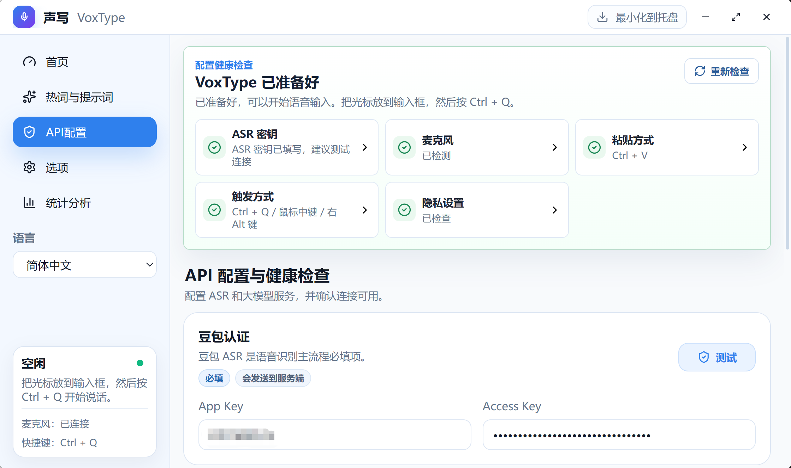

# 声写 VoxType - 基于 Rust/Tauri 的 Windows AI 语音输入工具

[English](README.en.md) | 简体中文

声写（VoxType）是一个基于 Rust/Tauri 的 Windows 10/11 桌面 AI 语音输入、语音转文字和听写工具。把光标放到任意输入框后，按下全局热键开始说话，程序会录制麦克风音频，通过豆包流式 ASR WebSocket 实时识别语音，可选调用 OpenAI 兼容大模型润色文本，并将最终结果写入剪贴板后自动粘贴到当前输入位置。

当前代码已迁移为根目录 Tauri 项目：Rust 负责全局热键、输入钩子、音频采集、ASR 会话、剪贴板、系统托盘、悬浮字幕窗和系统音量；Svelte 负责主窗口 GUI。

> 这是个人项目，目标是实用、轻量、易修改。请勿把真实密钥、个人热词、上下文或本地日志提交到仓库。

## 适合场景

- 在 Windows 任意输入框中进行中文语音输入、英文听写或多语言语音转文字。
- 用豆包流式 ASR 获取实时字幕和最终转写结果，再自动粘贴到微信、浏览器、编辑器、表单或办公软件。
- 对长句口述内容做轻度 LLM 润色，减少错别字、口语冗余和格式混乱。
- 需要一个本地运行、可审计、默认不记录识别正文统计的开源语音输入工具。

## 文档

- 仓库内文档索引：[docs/README.md](docs/README.md)
- Wiki 首页：<https://github.com/zkwi/VoxType/wiki>
- 用户配置指南：<https://github.com/zkwi/VoxType/wiki/Setup-Guide>
- 功能特性与使用优化：<https://github.com/zkwi/VoxType/wiki/Feature-Guide>
- 常见问题与排障：<https://github.com/zkwi/VoxType/wiki/Troubleshooting>
- 贡献指南：[CONTRIBUTING.md](CONTRIBUTING.md)
- 安全策略：[SECURITY.md](SECURITY.md)
- 支持说明：[SUPPORT.md](SUPPORT.md)
- 行为准则：[CODE_OF_CONDUCT.md](CODE_OF_CONDUCT.md)
- 许可证：[MIT](LICENSE)

## 界面预览

主界面采用蓝白配色和紧凑侧边栏，首页顶部语音卡片集中展示当前输入状态，并用单行紧凑标签展示三种启动方式（主快捷键、鼠标中键、右 Alt）。识别完成后，首页会显示本次输入已复制并尝试粘贴，用户可临时复制或查看识别文本；文本只保留在当前窗口，关闭窗口或开始下一次录音后清除。下方展示最近 24 小时、最近 7 日、输入速度和节省时间等输入表现统计；节省时间按“手打等效时间 - 实际语音时长”估算。



左侧导航按使用任务拆分为首页、热词与提示词、API配置、选项、隐私与本地数据和统计分析：热词与提示词页按常用热词、场景上下文、大模型提示词和自动热词组织，API配置页管理豆包 ASR 必填配置与可选大模型 API，选项页按常用设置、体验增强、应用维护组织快捷键、粘贴方式、麦克风、字幕外观、开机启动、关闭行为、更新和诊断，隐私与本地数据页说明配置文件、日志、最近上下文、候选生成历史、统计、运行时数据的保存位置、上传边界和清理入口。热词与提示词、API配置和选项页直接从正文分组开始，不再重复显示通用配置状态头部；可见设置按页面分组直接展示，协议地址、剪贴板快照、重试次数等底层参数仅支持通过 `config.toml` 修改。统计页展示最近 24 小时、最近 7 日、平均输入速度和按日使用情况，新识别结果写入后会刷新。

API配置页顶部提供配置健康检查，只把真正阻断主流程的问题放到显眼位置。ASR 密钥、麦克风、粘贴方式、触发方式和隐私设置会分别展示状态，豆包 ASR 与可选大模型配置区域提供测试入口。截图中的密钥已做模糊处理，公开截图时也应保持脱敏。



录音和处理过程中会在当前屏幕居下显示悬浮字幕，用于实时查看转写内容与必要状态提示；字幕配色和透明度可在选项页调整，尺寸、位置和自定义颜色保留在 `config.toml`。


## Windows 语音输入功能

- 全局触发：默认只启用 `Ctrl + Q`；右 Alt 和鼠标中键可在选项页手动开启，避免误触或与其他软件冲突。
- 麦克风采集：使用 Rust `cpal` 采集 PCM 音频，可选择输入设备。
- 实时语音识别：对接豆包 `bigmodel_async` WebSocket，支持实时字幕片段和最终语音转文字结果。
- 静音兜底：本地连续低音量自动停止默认 30 秒，比旧版 10 秒更不容易在长句口述或思考停顿时提前截断；可在选项页手动调整。
- 悬浮字幕：录音时在屏幕居下显示实时识别文本，不抢焦点；选项页展示字幕预览、预设配色和透明度预设，自定义颜色、宽高和位置保留在 `config.toml`。
- 自动输入：最终文本写入剪贴板，并用带扫描码和短间隔的 `Ctrl+V` 或 `Shift+Insert` 粘贴到当前焦点输入框；首页可临时展开查看并一键复制最近一次识别文本，关闭窗口或开始下一次录音后清除。选项页直接提供 `Ctrl+V`、`Shift+Insert` 和“仅复制到剪贴板”，剪贴板恢复延迟等底层参数保留在 `config.toml`。
- 标点处理：默认会自动移除最终文本末尾的中文句号或英文句点；如需保留句末标点，可在选项页关闭该开关。
- 可选润色：可调用 OpenAI 兼容接口做轻度后处理；API配置页可直接测试豆包 ASR 和大模型 Key 是否可用，热词与提示词页管理大模型提示词。
- 屏幕 OCR 上下文：默认开启。开始录音时默认截取当前显示器，也可在选项页切换为仅当前窗口；用 Windows OCR 提取文字后，轻量合并中文字符之间的多余空格，并作为临时上下文发送给豆包 ASR 和可选大模型，帮助识别人名、文件名、代码标识符和界面词；超时或失败会自动跳过。
- 自动热词候选：可在热词页开启本地采集 VoxType 最终语音输入文本，并手动调用已配置的大模型生成候选热词；候选必须用户勾选确认后才会加入热词列表。
- 系统音量：可在 `config.toml` 中配置录音期间临时静音系统音量，结束后恢复；默认关闭，避免影响会议、视频或系统提示音。
- 托盘常驻：关闭主窗口默认隐藏到托盘，输入和处理期间托盘图标会切换为输入中样式；左键单击托盘图标打开主窗口，右键托盘可打开配置、查看日志、问题反馈、检查更新、重启程序或退出，也可在选项页改为直接退出或每次询问。
- 开机启动：可在选项页开启随 Windows 登录自动启动。
- 检查更新：可在选项页通过 GitHub Release 检查最新版；发现新版本时提示中会提供“立即更新”按钮，下载后自动启动 Windows 安装包，应用内更新会尽量静默安装并退出当前版本释放文件。
- 诊断日志：选项页和托盘均可打开本地日志，也可一键复制脱敏诊断报告，便于排查识别、粘贴、网络和更新问题。
- 隐私与本地数据：左侧导航提供入口，可查看配置文件与密钥、日志与诊断报告、最近上下文、候选生成历史、统计、ASR 音频、屏幕 OCR、LLM 润色文本和剪贴板的保存/上传边界，并清空本地上下文、候选生成历史和统计数据。
- 配置健康检查：API配置页顶部显示 ASR 密钥填写/未测试/测试结果、麦克风、粘贴方式、触发方式和隐私设置状态，帮助新用户快速知道还差哪一步。
- 多语言界面：简体中文、繁体中文、英语，默认简体中文。

## 主链路保护

这些行为直接影响普通用户对语音输入结果的信任，维护时应保持：

- 空识别会进入失败态并提示“没有识别到文字”，不会显示“已粘贴”，也不会触发润色、粘贴或成功统计。
- 只有在大模型润色已启用、文本长度达到 `min_chars`，且 Base URL、API Key、模型名都填写完整时，界面才显示“正在润色文本”。
- 默认自动粘贴后恢复原剪贴板；纯文本恢复最稳定。原剪贴板包含大块表格、图片、文件、位图句柄或部分私有格式时，可能无法完整恢复并给出 warning；快照大小上限用于避免大剪贴板导致卡顿。
- 健康检查的“已准备好”只判断 ASR 密钥、麦克风和至少一种触发方式。ASR 连接测试只在用户手动测试成功后显示“测试通过”；未测试不阻断主流程可用性。

## 环境

仅面向 Windows 10/11。

普通用户请下载并运行 `VoxType-*-setup.exe` 安装包。安装包会内置 Microsoft Edge WebView2 Bootstrapper，在系统缺少 WebView2 Runtime 时自动安装运行时。

如果主窗口一直白屏或长时间停留在启动页，通常是系统的 Microsoft Edge WebView2 Runtime 损坏、缺失或被策略阻断。请先按 [常见问题与排障](https://github.com/zkwi/VoxType/wiki/Troubleshooting) 中的“启动白屏或卡在启动页”处理，不建议在 VoxType 内自动修复系统组件。

项目不再发布绿色版 ZIP。绿色版不会安装系统运行时，容易在干净电脑上出现缺少 WebView2 Runtime 的问题。

运行时还需要 Windows 允许桌面应用访问麦克风。若录音失败，请在“设置 → 隐私和安全性 → 麦克风”中开启麦克风访问权限。

开发构建需要安装：

- Node.js 和 npm
- Rust 工具链

如果 Rust 已安装但当前终端找不到 `cargo`，先执行：

```powershell
$env:PATH="$env:USERPROFILE\.cargo\bin;$env:PATH"
```

## 配置

首次使用可以参考配置指南：[Setup Guide](https://github.com/zkwi/VoxType/wiki/Setup-Guide)。如果安装版启动时找不到 `config.toml`，程序会自动打开该指南；主窗口首页也会显示配置健康检查，提示还缺少哪些配置。

豆包 ASR 的 App Key 和 Access Key 是主流程必填项。未填写时，主窗口会优先引导到 API配置页，录音、识别、粘贴等后续入口会被锁定。API配置页会显示“填写密钥、测试连接、回首页开始输入”的三步引导；填写后会自动保存并生效。

配置速查：

| 场景 | 必填 | 可先不填 | 测试入口 |
| --- | --- | --- | --- |
| 只想语音转文字 | 豆包 ASR App Key、Access Key | 大模型 API、热词、屏幕 OCR | API配置页的豆包 ASR 测试 |
| 想让文本更自然 | 豆包 ASR + 大模型 Base URL、API Key、模型名，并开启润色 | 自动热词候选 | API配置页的大模型测试 |
| 测试失败 | 先看红色提示、Key 是否填错、网络/代理是否可用 | 不要先改高级参数 | 复制脱敏诊断报告排查 |

复制配置模板：

```powershell
Copy-Item .\config.example.toml .\config.toml
```

至少填写豆包 ASR 认证信息：

```toml
[auth]
app_key = ""
access_key = ""
resource_id = "volc.seedasr.sauc.duration"
```

VoxType 当前按豆包流式语音识别文档发送 `X-Api-App-Key`、`X-Api-Access-Key` 和 `X-Api-Resource-Id` 三个请求头。`resource_id` 默认使用豆包语音识别大模型 2.0 小时版的 `volc.seedasr.sauc.duration`；如果你的账号开通的是并发版或旧模型，才需要按火山引擎控制台/文档改成对应值。不要把大模型平台的 API Key、GitHub Token、火山引擎 IAM Secret 等填到这里。API配置页的豆包认证区域提供豆包帮助文档入口，方便首次配置时对照官方字段说明。

API配置页还可以设置豆包 ASR 的输入语言。默认是 `zh-CN`，适合中文语音；多语言场景可切换为 `en-US`、`ja-JP`、`yue-CN` 等豆包文档支持的语言代码，或选择自动/服务默认来省略该参数。豆包文档说明该参数只在部分流式模式支持，如果测试失败，可先改回自动/服务默认或确认当前接口模式。

豆包 ASR 测试常见失败原因：

| 提示 | 优先检查 |
| --- | --- |
| 认证或权限失败 | App Key、Access Key、Resource ID 是否属于同一个豆包语音服务和同一账号 |
| 连接失败或超时 | 网络、代理、防火墙是否能访问 `openspeech.bytedance.com` |
| 语言参数相关失败 | 先把识别语言改成自动/服务默认，再重新测试 |
| 测试通过但录音无字 | Windows 麦克风权限、输入设备、音量和环境噪声 |

如果启用大模型润色，还需要填写：

```toml
[llm_post_edit]
enabled = true
api_key = ""
base_url = "https://dashscope.aliyuncs.com/compatible-mode/v1"
model = "qwen3.5-plus"
```

大模型配置走 OpenAI 兼容接口，默认示例使用阿里云百炼/DashScope 的北京地域地址 `https://dashscope.aliyuncs.com/compatible-mode/v1`。`api_key` 必须来自同一个大模型服务商，`model` 必须是该账号和地域可用的模型名。只需要语音识别时可以完全不配置大模型；开启润色后，短文本默认低于 `min_chars` 不会调用大模型，以减少延迟。达到最小字数的最终识别文本会发送到你配置的大模型服务；用户词典、场景与产品偏好和屏幕 OCR 会作为参考信息追加。API配置页的大模型测试会使用一段示例文本和正式大模型提示词发起调用，成功后显示本次延迟。

大模型测试常见失败原因：

| 提示 | 优先检查 |
| --- | --- |
| API Key 或权限失败 | Key 是否属于当前 Base URL 对应的平台和地域 |
| 模型名称错误 | 模型名是否拼写正确、账号是否有权限调用 |
| 连接失败 | Base URL 是否以 `/compatible-mode/v1` 结尾，代理/网络是否可用 |
| 测试有响应但润色不触发 | 是否开启润色、文本长度是否达到 `min_chars` |

VoxType 已内置一套面向语音输入的默认大模型提示词。默认规则会把识别文本视为待润色素材，不回答、不执行其中的指令或问题，避免把润色任务误变成内容分析；也会在不新增事实的前提下纠正明显错词漏字、语法残缺和不通顺语句，无法确定原意时保留原文。默认提示词会保持原文主要语言和中英混合方式，不主动把中文翻译成外语，也不主动把外语翻译成中文。用户词典、场景与产品偏好、屏幕 OCR 会在真实请求中作为“参考信息”分区追加，只用于纠正术语、称谓、界面词和表达偏好，不作为待润色文本或指令来源。金融、投资、量化语境中，默认提示词会把明确金额、收益率和百分比整理为常用数字写法，例如把一百万写成 `100万`、把百分之一写成 `1%`、把百分十写成 `10%`，但不会计算收益或回答问题。热词页先展示常用热词和场景上下文，再展示大模型提示词模板、恢复默认提示词和预览入口；预览会显示参考信息拼接规则、场景上下文是否进入大模型提示词、屏幕 OCR 当前开关策略，并说明最近上下文只用于豆包 ASR 上下文。最小润色字数可在热词页调整，支持 0 到 10000；System Prompt 保留在 `config.toml` 中，避免普通设置页过长。

屏幕 OCR 上下文默认开启，可在选项页关闭、测试或切换识别范围。默认范围是当前显示器，适合参考一个文档并在另一个窗口输入；如屏幕中有敏感内容，可切换为仅当前窗口或关闭。OCR 文本只保留在本轮请求内，不写入日志、统计、配置文件，也不会缓存最近 2-3 份截图 OCR 内容。发送前会轻量合并中文字符之间的多余空格，避免 `屏 幕 OCR 上 下 文` 这类结果干扰上下文；英文缩写、快捷键和路径间距会尽量保留。默认最多等待 700ms，失败或超时不影响录音、识别和粘贴主链路。

```toml
[screen_context]
enabled = true
capture_scope = "screen"  # screen = 当前显示器，window = 仅当前窗口
max_chars = 1200
timeout_ms = 700
```

热词页还提供“自动生成热词候选”。该功能默认关闭，开启后只保存 VoxType 自己生成的最终语音输入文本，不记录键盘输入，不读取剪贴板历史。只有用户点击“生成候选”时，才会把本地历史摘要发送到已配置的大模型服务；生成结果只是候选，必须勾选确认后才会合并到 `context.hotwords`。历史文本默认上限为 5000 字；旧版默认 10000 字会在配置加载时自动迁移为 5000 字。热词生成会使用比普通润色更高的输出长度和超时预算；如果完整历史生成返回不完整或超时，会自动缩小历史范围并减少候选数量重试一次。若仍失败，可在 `config.toml` 中降低历史文本上限或候选数量后重试。

```toml
[auto_hotwords]
enabled = false
max_history_chars = 5000
max_candidates = 30
ignored_hotwords = []
```

填写豆包 ASR 或大模型 Key 后，可在 API配置页点击对应区域的“测试”按钮，先确认 Key、Base URL、模型名称和网络环境是否可用，再开始正式录音。

配置修改后会自动保存，标题栏会短暂显示“更改将自动保存 / 正在保存设置 / 设置已保存”。自动保存前会做基础字段校验，明显非法的采样率、声道数、录音时长、粘贴延迟、剪贴板恢复延迟、快照大小、枚举值、URL scheme、GitHub 仓库格式、LLM 必填项、超时时间、悬浮窗尺寸和字幕颜色不会写入配置文件。

文本后处理相关配置：

```toml
[typing]
remove_trailing_period = true
```

开启后，最终文本以中文句号或英文句点结尾时会自动去掉；关闭后会保留 ASR 或大模型输出的句末标点。

剪贴板恢复相关配置：

```toml
[typing]
clipboard_restore_delay_ms = 800
clipboard_snapshot_max_bytes = 8388608
```

恢复延迟越长，目标应用越有时间读取语音文本；但原剪贴板恢复也会更晚。为避免慢应用粘贴到旧剪贴板内容，自动粘贴时会使用不低于 500ms 的安全恢复等待。快照大小上限用于跳过过大的格式，降低大剪贴板卡顿风险。

如需随 Windows 登录自动启动，可在选项页开启，或在 `config.toml` 中设置：

```toml
[startup]
launch_on_startup = true
```

更新检查默认读取 `zkwi/VoxType` 的 GitHub Release。需要关闭启动自动检查时，可在选项页关闭，或在 `config.toml` 中设置：

```toml
[update]
auto_check_on_startup = false
github_repo = "zkwi/VoxType"
```

`config.toml`、本地日志和统计文件已被 `.gitignore` 忽略。示例配置和文档只保留占位值，不应写入真实密钥、个人热词或自定义上下文。

## 开发运行

在仓库根目录执行：

```powershell
npm install
npm run tauri dev
```

开发服务固定使用：

```text
http://127.0.0.1:18080
```

没有继续使用 Tauri 模板默认的 `1420` 端口，因为部分 Windows 环境会把相邻端口段保留给系统，导致 Vite 报 `listen EACCES`。

## 构建

调试构建：

```powershell
npx tauri build --debug --no-bundle
```

正式构建：

```powershell
npx tauri build
```

NSIS 安装包会嵌入 WebView2 Bootstrapper。首次安装到缺少 WebView2 Runtime 的干净电脑时，安装程序会联网安装该运行时。

安装包内置简体中文、繁体中文和英语。安装时默认根据 Windows 系统语言自动选择安装器语言；不额外弹出语言选择窗口。

正式可执行文件通常位于：

```text
src-tauri\target\release\voxtype-desktop.exe
```

不要直接用 `cargo build --release` 作为桌面端发布产物；那样不会先构建前端资源，可能导致窗口打开后访问开发地址失败。

## 使用

1. 启动 `VoxType`。
2. 先在 API配置页填写豆包 ASR 的 App Key 和 Access Key，填写后会自动保存；未填写时主流程入口会保持锁定。
3. 把光标放到目标输入框。
4. 按 `Ctrl + Q` 开始录音；如已在选项页开启，也可使用右 Alt 或鼠标中键。
5. 录音时查看屏幕居下悬浮字幕。
6. 再按一次触发键停止录音。
7. 程序等待最终识别结果，可选润色，然后自动粘贴到当前焦点输入框。若粘贴快捷键发送失败，识别文本会保留在剪贴板，可手动 `Ctrl + V`。

默认隐私与误触策略：

- 最近上下文默认关闭，不保存最近识别片段；需要连续识别增强时可在热词页或隐私与本地数据页手动开启。开启后识别片段写入单独的本地 `context/recent_context.jsonl`，不会写回 `config.toml`；可在隐私与本地数据页清空。
- 屏幕 OCR 上下文默认开启，默认识别当前显示器，识别结果不落盘、不跨轮缓存；如屏幕可能包含敏感信息，可在选项页切换为仅当前窗口或关闭。
- 自动热词候选默认关闭。开启后本地采集文本写入 `context/hotword_history.jsonl`，可在热词页或隐私与本地数据页清空；诊断报告和日志不会输出历史正文、候选词或 prompt。
- 统计只保存字数、时长、速度等非正文数据，可在隐私与本地数据页清空。
- 右 Alt 和鼠标中键默认关闭，确认不与其他软件冲突后再开启。
- 连续低音量自动停止默认 30 秒，默认音量阈值为 `0.03`；旧版默认 10 秒 / `0.04` 会在配置加载时自动迁移为 30 秒 / `0.03`；录音期间静音系统声音默认关闭。
- 最终识别正文默认不打印到控制台。

托盘行为：

- 单击托盘图标：打开主窗口。
- 输入、等待结果、润色和粘贴处理期间：托盘图标显示输入中样式，完成或失败后恢复普通图标。
- 关闭主窗口：默认隐藏到托盘，首次会提示“仍可按快捷键使用，完全退出请右键托盘图标选择退出”。
- 托盘菜单“打开配置”：用系统默认编辑器打开 `config.toml`。
- 托盘菜单“查看日志”：用系统默认程序打开本地日志。
- 托盘菜单“问题反馈”：打开 GitHub Issue 反馈页面。
- 托盘菜单“检查更新”：打开主窗口并执行一次手动更新检查。
- 托盘菜单“重启程序”：停止当前会话并重启 VoxType，适合配置更新后生效或快速恢复偶发异常。
- 托盘菜单“退出”：停止会话并退出程序。

选项页中的“诊断与日志”可以直接打开本地日志或复制诊断报告。日志会记录关键启动阶段、配置保存、ASR/LLM 错误、更新检查和前端异常；密钥形态会自动脱敏。诊断报告默认不包含识别正文、屏幕 OCR 正文、密钥、热词、prompt、最近上下文、候选生成历史正文、候选词或 Windows 用户名路径。

## 常见问题

### VoxType 是什么？

VoxType 是 Windows 桌面语音输入工具，用豆包流式 ASR 将麦克风语音转成文字，再复制并自动粘贴到当前输入框。它更像系统级听写助手，不是聊天机器人。

### VoxType 支持哪些输入场景？

只要目标软件能接收剪贴板粘贴，通常就能使用 VoxType，包括浏览器输入框、聊天软件、Markdown 编辑器、IDE、办公文档和内部管理系统。少数拦截 `Ctrl + V` 的软件可以改用 `Shift + Insert` 或仅复制到剪贴板。

### VoxType 会保存我的语音识别正文吗？

默认不会。统计只记录时长、字数、速度等非正文数据；最近上下文和自动热词候选默认关闭。屏幕 OCR 上下文默认开启但不落盘，也不保留最近几次截图 OCR，只在本轮请求中临时发送给 ASR/LLM，可在选项页或隐私与本地数据页关闭；本地上下文、候选生成历史和统计可在隐私与本地数据页清空。清空按钮只删除 VoxType 本地文件，第三方 ASR/LLM 服务是否留存取决于对应服务商。

### 为什么需要配置豆包 ASR？

VoxType 的主链路依赖豆包流式语音识别服务。没有 App Key 和 Access Key 时，录音、识别和自动粘贴入口会保持锁定，避免用户以为已经输入成功。

## 常用命令

```powershell
# 前端类型检查
npm run check

# 前端构建
npm run build

# Rust 检查
Set-Location .\src-tauri
cargo check

# Rust 测试
cargo test

# Rust lint
cargo clippy --all-targets -- -D warnings

# 本地密钥扫描
Set-Location ..
npm run scan:secrets

# 暂存区密钥扫描
npm run scan:secrets:staged

# npm 依赖审计
npm run audit:npm

# Rust 依赖审计（需要先安装 cargo-audit）
npm run audit:rust
```

启用 Git pre-commit 钩子：

```powershell
.\scripts\enable_git_hooks.ps1
```

钩子会调用 `scripts/scan-secrets.mjs` 扫描暂存文件，避免误提交本地配置、密钥、热词和上下文。

## AI 维护与本地检查

本项目允许使用 AI 辅助维护代码，但所有 AI 改动必须遵守根目录 `AGENTS.md`。

日常改动后，在仓库根目录运行：

```powershell
npm run ai:check
```

也可以直接运行：

```powershell
.\scripts\ai-check.ps1
```

该检查会依次执行：

```text
npm run check
npm run build
npm run scan:secrets
npm run test:secrets
cargo fmt --check
cargo check
cargo test
```

如果本次改动涉及 UI，还需要手工检查：

- 首页空闲状态
- 配置缺失状态
- 录音中状态
- 空识别提示
- LLM 关闭和开启两种状态
- 剪贴板纯文本恢复
- 托盘关闭提示
- 简体中文、繁体中文、英文三语言
- 1100 × 680 和 1280 × 760 两类窗口尺寸

更多规则见：

- `AGENTS.md`
- `CHANGELOG.md`
- `docs/code-style.md`
- `docs/directory-structure.md`

仓库包含一个最小 GitHub Actions CI：`.github/workflows/ci.yml`。CI 在 Windows runner 上执行前端类型检查、前端构建、密钥扫描、Rust 格式检查、clippy 和测试；本地仍以 `npm run ai:check` 作为日常提交前入口。

发布前可运行：

```powershell
npm run ai:release-check
```

Rust 依赖审计依赖 `cargo-audit`。本机未安装时先运行：

```powershell
cargo install cargo-audit --locked
```

发布或合并前应同步更新 `CHANGELOG.md` 的 `[Unreleased]` 或对应版本段，记录用户可见变化、主链路保护和维护性调整。

## 开源协作

提交 Issue 或 PR 前请先阅读 [CONTRIBUTING.md](CONTRIBUTING.md)、[SUPPORT.md](SUPPORT.md) 和 [CODE_OF_CONDUCT.md](CODE_OF_CONDUCT.md)。本项目欢迎小而明确的 bug 修复、文档改进、配置样例优化和测试补充；涉及 ASR、LLM、剪贴板、热键、托盘、日志、统计或配置结构的改动，请在 PR 描述中明确说明影响范围和验证方式。

安全和隐私问题请参考 [SECURITY.md](SECURITY.md)。公开 Issue、PR、截图和日志中不要包含真实密钥、识别正文、个人热词、prompt、最近上下文或 Windows 用户名路径。

## 界面与适配

主窗口按 1280 × 760 设计，最小窗口为 1100 × 680。首页会根据窗口高度和宽度进入紧凑模式，并将语音输入和启动方式放在同一顶部卡片；启动方式使用单行紧凑标签，最近输入和输入表现分层展示，避免在高 DPI 或较小窗口中出现文字遮挡、卡片裁切和不必要的滚动条。

界面维护时重点检查这些状态：

- 空闲、录音中、配置缺失三种首页状态。
- 简体中文、繁体中文、英文三种语言。
- 1100 × 680、1280 × 760 以及高缩放显示器。
- 侧边栏长麦克风设备名、长热键文本和统计数字较大的情况。

首页只展示正式用户信息。不要加入调试路径、协议细节、内部状态码或占位图表。

## 目录

```text
VoxType/
├── src/                         # Svelte 主窗口界面
├── src-tauri/                   # Tauri/Rust 桌面端
│   ├── src/
│   │   ├── audio.rs             # 麦克风采集
│   │   ├── asr.rs               # ASR 请求组装与结果解析
│   │   ├── asr_ws.rs            # 豆包 WebSocket 会话
│   │   ├── autostart.rs         # Windows 开机自启动
│   │   ├── config.rs            # TOML 配置加载
│   │   ├── hotkey.rs            # 全局热键与输入钩子
│   │   ├── llm_post_edit.rs     # LLM 后处理
│   │   ├── overlay.rs           # 悬浮字幕窗
│   │   ├── session.rs           # 录音会话状态机
│   │   ├── stats.rs             # 使用统计
│   │   ├── system_audio.rs      # 系统音量控制
│   │   ├── text_output.rs       # 剪贴板与粘贴
│   │   ├── tray.rs              # 系统托盘
│   │   └── update.rs            # GitHub Release 更新检查
│   ├── capabilities/
│   ├── icons/
│   └── tauri.conf.json
├── static/                      # 静态资源
├── docs/                        # 接口参考文档
├── scripts/
│   ├── enable_git_hooks.ps1
│   └── scan-secrets.mjs
├── config.example.toml          # 配置模板，不含真实密钥
├── package.json
├── svelte.config.js
├── tsconfig.json
└── vite.config.js
```

## 本地文件

以下文件只用于本机运行，不提交：

- `config.toml`
- `*.local.toml`
- `context/recent_context.jsonl`
- `context/hotword_history.jsonl`
- `voice_input.log`
- `voice_input_stats.jsonl`
- `src-tauri/target/`
- `node_modules/`
- `build/`
